# Inventory Management System

A **JavaFX-based desktop application** to manage products, stock, and customer orders efficiently.
This system provides two roles: **Manager** and **Customer**, enabling complete product management, order tracking, and inventory insights.

---

## Login Credentials

| Role        | Username | Password   |
| ----------- | -------- | ---------- |
| **Manager** | `admin`  | `admin123` |

---

## Tech Stack

* **Java 21**
* **JavaFX SDK (GUI)**
* **VS Code (Recommended IDE)**

---

## Features

### Manager Portal

* Secure login authentication
* Add new products (ID, Name, Category, Stock, Price)
* Update existing product details
* View all available products
* Check low-stock items
* View sales statistics
* Review customer purchase log

### Customer Portal

* Browse available products
* Place orders by entering product ID and quantity
* View total cost and select delivery mode (Land / Sea)
---

## Application Screenshots

### **1. Login Page**

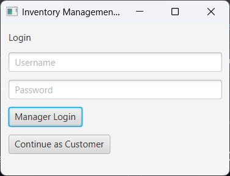

### Invalid Credentials

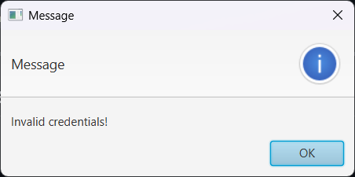

---

## **2. Manager Portal**

### a. Add Product

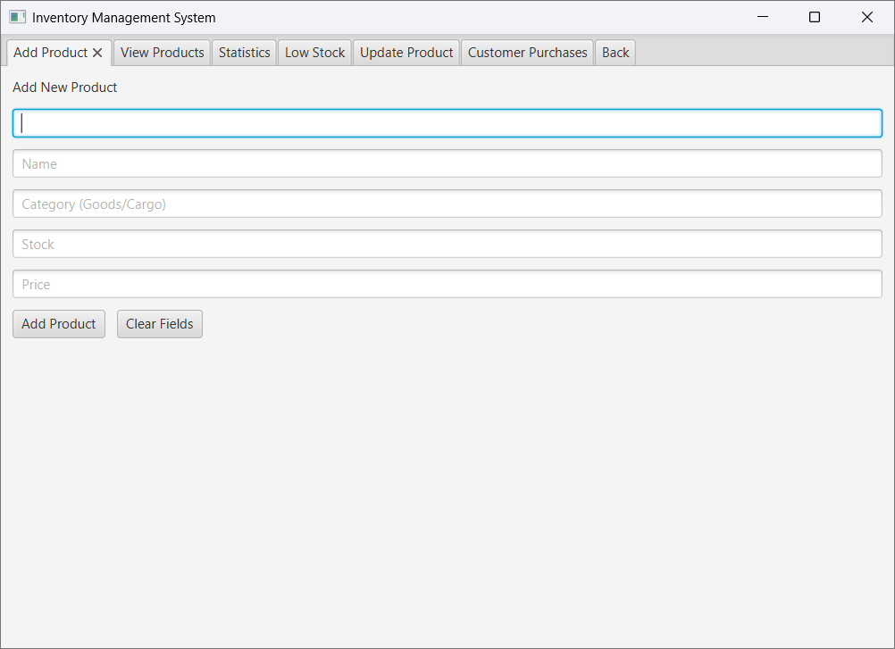

### b. View Products

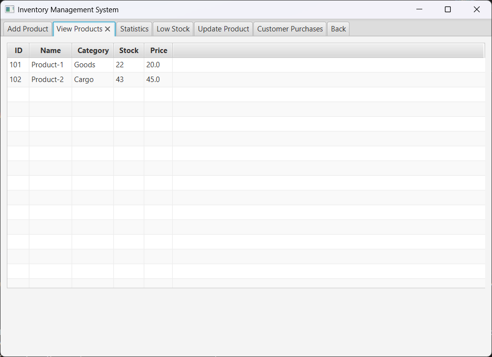

### c. Statistics

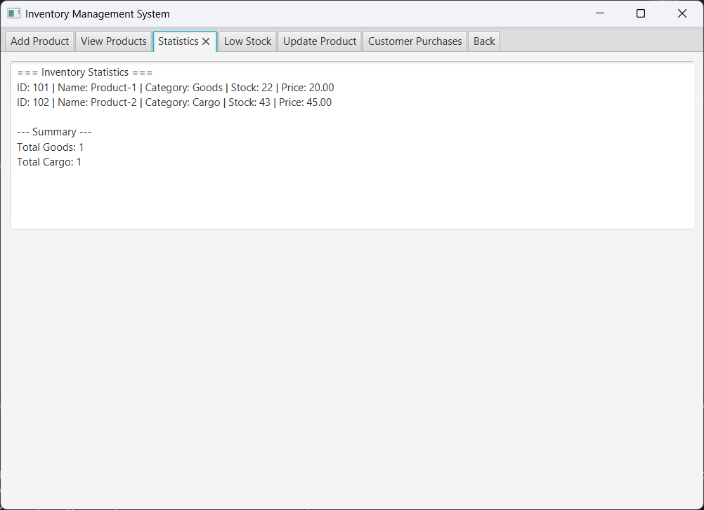

### d. Low Stock

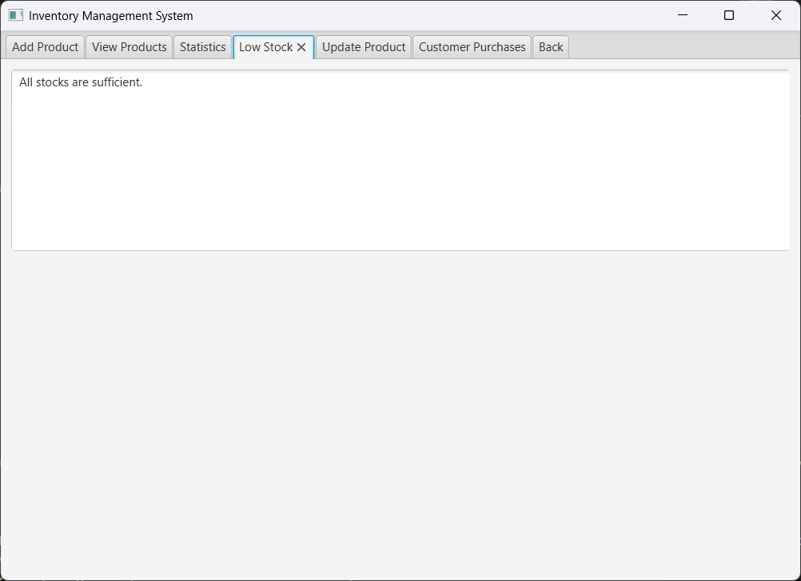

### e. Update Product

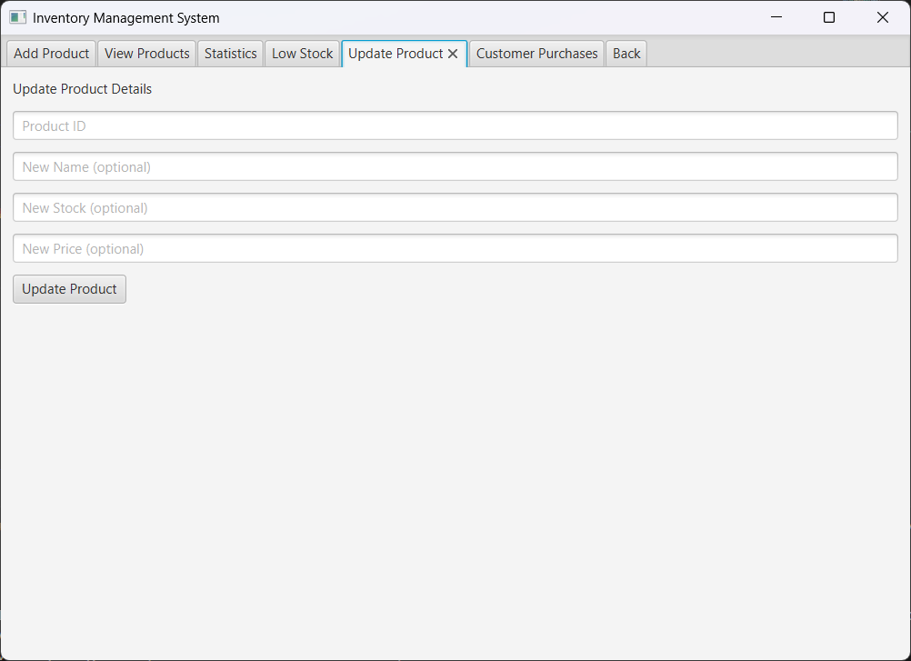

### f. Customer Purchases

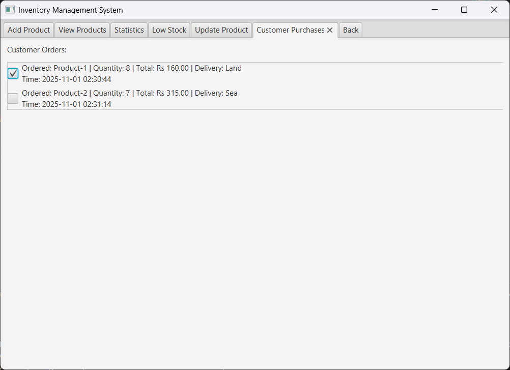

---

## **3. Customer Portal**

### a. Customer Menu

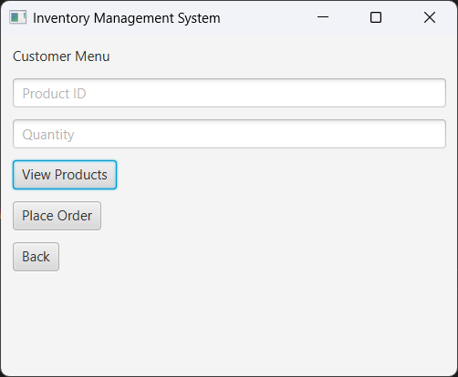

### b. View Products

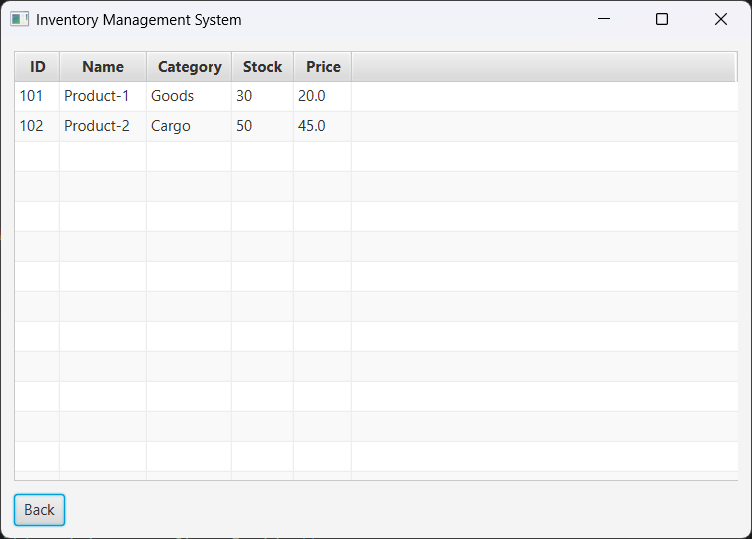

### c. Place Order

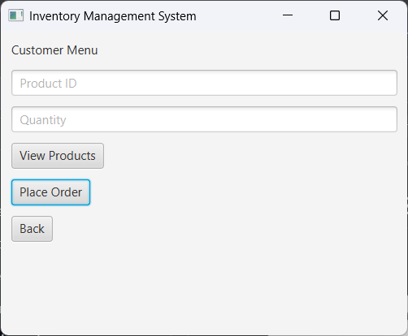

### d. Order placed

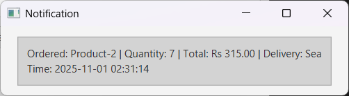

---

## Folder Structure

```
InventoryManagementSystem/
│
├── src/
│   ├── com/inven/       # Inventory & stock handling
│   ├── com/prod/        # Product class definitions
│   ├── com/user/        # Manager and Customer classes
│   ├── com/ord/         # Order management
│   └── com/ui/          # JavaFX UI components
│
├── bin/                 # Compiled .class files (not added in this repo)
├── images/              # Screenshots for README
└── README.md
```
---

## How to Run

### Setup JavaFX SDK

Download and extract JavaFX SDK, and note the `/lib` path.

### Compile all 

```bash
javac --module-path "/path/to/javafx-sdk/lib" --add-modules javafx.controls,javafx.fxml -d bin src/com/inven/*.java src/com/prod/*.java src/com/user/*.java src/com/ord/*.java src/com/ui/*.java
```

### Run

```bash
java --module-path "/path/to/javafx-sdk/lib" --add-modules javafx.controls,javafx.fxml -cp bin com.ui.InventoryManagement
```

> Replace `"/path/to/javafx-sdk/lib"` with your actual path.

> Update the `"/path/to/javafx-sdk/lib"` in `.vscode/settings.json` and `.vscode/launch.json` to match your JavaFX SDK location before running.
